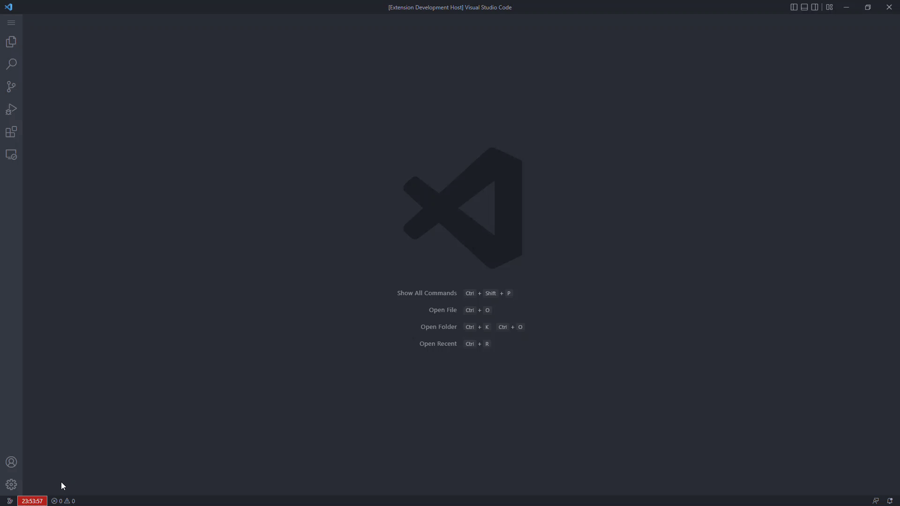

# Clock Extension

## Description
This is a vscode extension which displays a clock on the status bar. This is 
not intended to be a production quality extension and it only for explorative
purposes. Feel free to copy, use, or share.
## Getting Started
*Make sure to both node and npm are installed installed and up to date.* <br> Open the
extension in VS Code 1.47+ and run
- ```npm install```
- ```npm run watch``` or ```npm run compile```<br>
Then press ```F5``` to start debugging. 

## Features
The extension counts using a military clock. The user can set a timer by clicking
on the clock and entering a timer in the outlined format.

The clock then counts down the desired time and notifies the user on completion.
Using the visual studio extension API, the timer stores the last used timer
length into a local .vscdb file and retrieves it in the next timer prompt.
##  Sources
Here are some recources I checked out while making the project
- https://code.visualstudio.com/api/get-started/your-first-extension
- https://github.com/microsoft/vscode-extension-samples/tree/main/webview-sample
- https://code.visualstudio.com/api/references/vscode-api
- https://www.geeksforgeeks.org/what-is-setinterval-in-javascript/


